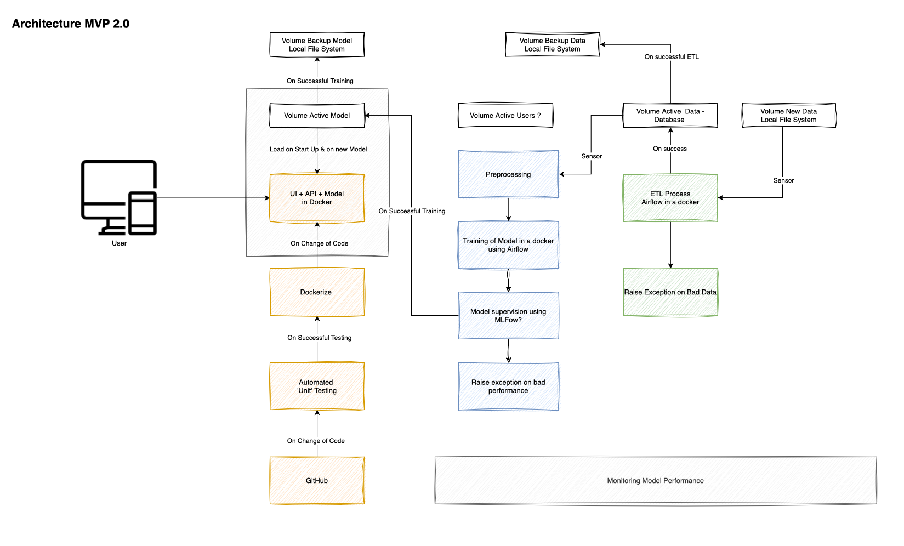

🚦 Green Light Services
==============================

<p align="center">
 
</p>


The `Green Light Services` provide Dashboards for historic traffic situations in local municipalities and it makes predictions on the gravity of [road accidents](https://www.data.gouv.fr/en/datasets/bases-de-donnees-annuelles-des-accidents-corporels-de-la-circulation-routiere-annees-de-2005-a-2019/) in selected hot spots. 

This project is a starting Pack for MLOps projects based on the subject "road accident". It's not perfect so feel free to make some modifications on it.

# 👨🏼‍💻👩‍💻👨🏻‍💻 Development Team

Green Lights Services has been developed by:
- Josef Hartmann
- Paula Robina Beck
- Evan Blablapoulos

Green Light Services represents our final project for the DataScientest MLOps Program.

# 🏗️ Architecture

The Green Light Services is a web application that uses microservices and runs on [Docker compose](https://docs.docker.com/compose/). The following figure summarizes the architecture of the Green Light Services application:


<p align="center">
    <b>Figure 1.</b> The Green Light Services architecture.
</p>

Our docker-compose application includes the following:
- `Airflow` with a custom base docker image.
- A dedicated `postgres` database `RoadAccidents` where the raw road accidents data are stored.
- `pgadmin` which is a dashboard to manage the `RoadAccidents` database.
- `model_api` which is a FastAPI application responsible for making ML predictions
- `UI` the Green Light Services UI Dashboard

The Green Light Services docker-compose application is configured through enviroment variables stored in the `.env` file.

We use the Github Actions to implement the CI/CD pipelines of the Green Light Services app. More specifically:
- CI: everytime there is a Pull Request to merge a branch to master all unit-tests need to pass
- CD: The docker images are build and pushed to the Docker Hub [roadaccidentsmlops24]](https://hub.docker.com/repositories/roadaccidentsmlops24).

TODO a few words on how we perform authorization.

# 📂 Project Organization
The repository is structured as follows:

```
    ├── .github/
    │    │
    │    └── workflows/                     
    │
    ├── README.md          
    │
    ├── Airflow                
    │   │
    │   ├── dags           
    │   │   ├── ingest_road_accident_csv_to_db.py    
    │   │   └── 1_training_pipeline_dag.py 
    │   │
    ├── Volumes     
    │   │
    │   ├── airflow/        
    │   ├── data/         
    │   ├── db/       
    │   ├── db_admin/
    │   ├── model
    │   │   ├── archive  
    │   │   └── new
    │   │
    ├── notebooks          
    │
    ├── models             
    │
    ├── notebooks         
    │
    ├── python-packages                
    │   │
    │   ├── green_light_ui
    │   ├── model_api           
    │   └── road_accidents_database_ingestion
    │
    ├── references         
    │
    ├── .env         
    │
    └── docker-compose.yml         
```

# 👩‍💻 Development

Python version used 3.12.

# 👟 Running the App

Clone this repository and run:

```
DOCKER_BUILDKIT=1 docker-compose up -d
```

In case you do not want to access to the Docker Hub [roadaccidentsmlops24]](https://hub.docker.com/repositories/roadaccidentsmlops24), you will have to build the Docker Images manually. Please refer to the individual `README.md` files of `python-packages` on how to do so.


# 📝 TODO List / Remaining Items

# 😿 Things to Improve

- We couldn't use [secrets in Github Actions](https://docs.github.com/en/actions/security-guides/using-secrets-in-github-actions), we guess due to user permissions on this forked repo? Unfortunatelly the Docker Hub token is pasted directly in the Github actions which is a really bad practice.


------------------------

<p><small>Project based on the <a target="_blank" href="https://drivendata.github.io/cookiecutter-data-science/">cookiecutter data science project template</a>. #cookiecutterdatascience</small></p>
