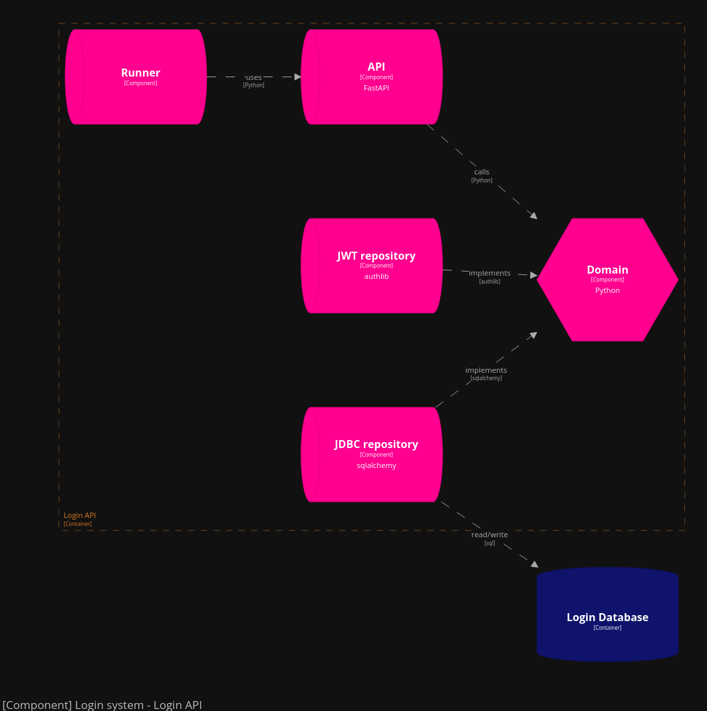

# Login application

The Login application allows to create users from the admin user, generate a login token for a user and expose the jwks service to validate the tokens by other services.

The application is built on a hexagonal architecture and has 1 left API adapter exposing the endpoints with FastAPI and 2 right adapters, JDBC repository allowing the storage of user data in PostgreSQL and a technical brick JWT repository allowing the generation of tokens.




# Run application

```bash
docker build .
docker compose up
```

# Create Admin user

```curl
curl -X POST --location "http://127.0.0.1:8000/admins" \
    -H "Content-Type: application/json"
```

# Tests

Run `creation_request.http` to test connexion, creation and token validation.
