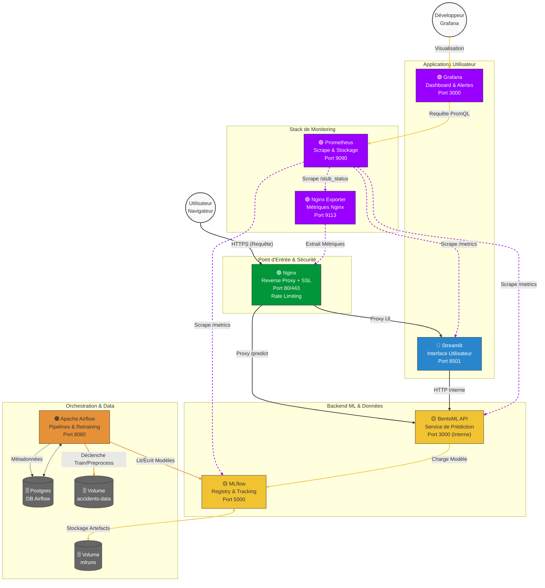

```mermaid
flowchart TD
    %% Définition des styles
    classDef user fill:#f9f9f9,stroke:#333,stroke-width:2px;
    classDef nginx fill:#009639,stroke:#333,color:white;
    classDef app fill:#2986cc,stroke:#333,color:white;
    classDef ml fill:#f1c232,stroke:#333;
    classDef monitor fill:#9900ff,stroke:#333,color:white;
    classDef data fill:#666,stroke:#333,color:white;
    classDef orchest fill:#e69138,stroke:#333;

    %% Acteurs Externes
    User(("Utilisateur<br/>Navigateur")):::user
    Dev(("Développeur<br/>Grafana")):::user

    %% Couche Entrée / Sécurité
    subgraph Entry_Point ["Point d'Entrée & Sécurité"]
        Nginx["🟢 Nginx<br/>Reverse Proxy + SSL<br/>Port 80/443<br/>Rate Limiting"]:::nginx
    end

    %% Applications
    subgraph Apps ["Applications Utilisateur"]
        Streamlit["🔵 Streamlit<br/>Interface Utilisateur<br/>Port 8501"]:::app
        Grafana["🟣 Grafana<br/>Dashboard & Alertes<br/>Port 3000"]:::monitor
    end

    %% Services Backend & ML
    subgraph Backend ["Backend ML & Données"]
        MlApi["🟡 BentoML API<br/>Service de Prédiction<br/>Port 3000 (Interne)"]:::ml
        Mlflow["🟡 MLflow<br/>Registry & Tracking<br/>Port 5000"]:::ml
    end

    %% Monitoring
    subgraph Monitoring ["Stack de Monitoring"]
        Prometheus["🟣 Prometheus<br/>Scrape & Stockage<br/>Port 9090"]:::monitor
        NginxExporter["🟣 Nginx Exporter<br/>Métriques Nginx<br/>Port 9113"]:::monitor
    end

    %% Orchestration & Data
    subgraph Orchestration ["Orchestration & Data"]
        Airflow["🟠 Apache Airflow<br/>Pipelines & Retraining<br/>Port 8080"]:::orchest
        Postgres[("🗄️ Postgres<br/>DB Airflow")]:::data
        VolData[("🗄️ Volume<br/>accidents-data")]:::data
        VolMl[("🗄️ Volume<br/>mlruns")]:::data
    end

    %% --- FLUX DE DONNÉES ---

    %% Flux Utilisateur
    User -->|"HTTPS (Requête)"| Nginx
    Nginx -->|"Proxy /predict"| MlApi
    Nginx -->|"Proxy UI"| Streamlit
    Streamlit -->|"HTTP Interne"| MlApi

    %% Flux Monitoring
    Prometheus -->|"Scrape /metrics"| MlApi
    Prometheus -->|"Scrape /metrics"| Streamlit
    Prometheus -->|"Scrape /metrics"| Mlflow
    Prometheus -->|"Scrape /stub_status"| NginxExporter
    NginxExporter -->|"Extrait Métriques"| Nginx
    Grafana -->|"Requête PromQL"| Prometheus
    Dev -->|"Visualisation"| Grafana

    %% Flux ML & Data
    MlApi -->|"Charge Modèle"| Mlflow
    Mlflow <-->|"Stockage Artefacts"| VolMl
    Airflow -->|"Déclenche Train/Preprocess"| VolData
    Airflow -->|"Lit/Écrit Modèles"| Mlflow
    Airflow -->|"Métadonnées"| Postgres
    
    %% Flux Interne Airflow
    Postgres <--> Airflow

    %% Légende des connexions
    linkStyle 0,1,2,3 stroke:#333,stroke-width:2px;
    linkStyle 4,5,6,7,8 stroke:#9900ff,stroke-width:2px,stroke-dasharray:5 5;
    linkStyle 9,10,11,12 stroke:#f1c232,stroke-width:2px;
    linkStyle 13,14 stroke:#e69138,stroke-width:2px;
```
