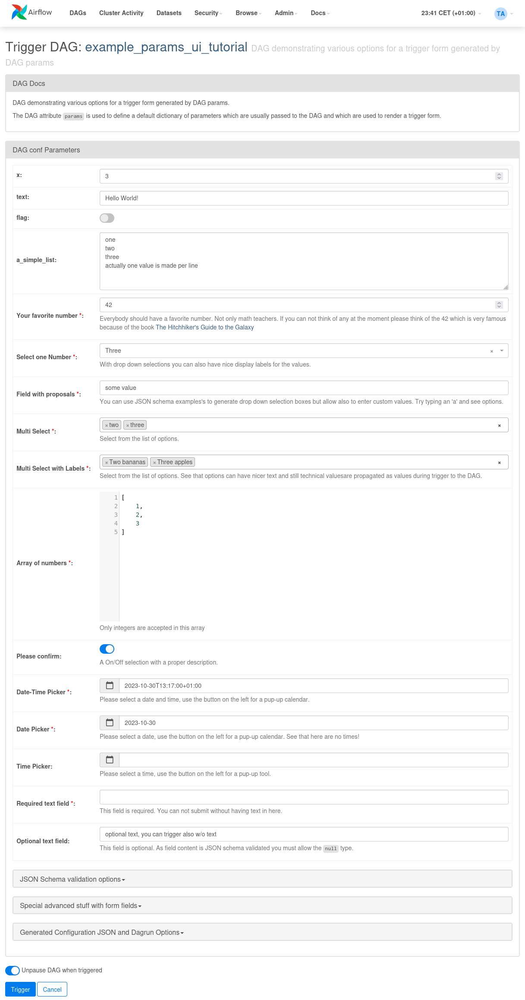

# ETL avec airflow

## (1) Retrieve data
## (2) Make Dataset
## (3) Creating a branch in LakeFS and push files

```python
import lakefs

branch1 = lakefs.repository("example-repo").branch("experiment1").create(source_reference="main")
print("experiment1 ref:", branch1.get_commit().id)

branch1 = lakefs.repository("example-repo").branch("experiment2").create(source_reference="main")
print("experiment2 ref:", branch2.get_commit().id)
```

branch_name = "UUID1"

# Training

## (1) Retrieve data with LakeFS

```python
import csv

branch = repo.branch("UUID1")
obj = branch.object(path="csv/....csv")

for row in csv.reader(obj.reader(mode='r')):
    print(row)
```

## (2) Build model with python

## (3) Store experiment in MLFlow

```python
# Store information in tracking server
with mlflow.start_run(run_name=run_name) as run:
    mlflow.log_params(params)
    mlflow.log_metrics(metrics)
    mlflow.sklearn.log_model(
        sk_model=rf, input_example=X_val, artifact_path=artifact_path
    )
```

run_name = "UUID1"

# Select model

With another airflow step, choose model

```python
 with DAG(
     "the_dag",
     params={
         "x": Param(5, type="integer", minimum=3),
         "my_int_param": 6
     },
 ) as dag:
```




## Merge model

### (1) MLFlow - add tag or register model

```python
from mlflow import MlflowClient

client = MlflowClient()

# Set registered model tag
client.set_registered_model_tag("example-model", "task", "classification")

# Delete registered model tag
client.delete_registered_model_tag("example-model", "task")

# Set model version tag
client.set_model_version_tag("example-model", "1", "validation_status", "approved")

# Delete model version tag
client.delete_model_version_tag("example-model", "1", "validation_status")
```

### (2) LakeFS merge in main

```python
# in LakeFS
res = branch.merge_into(main)
```
