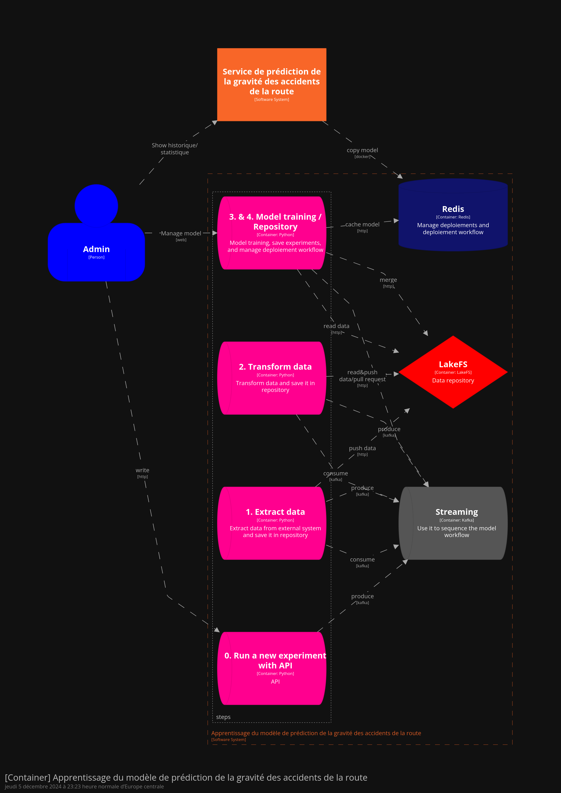

# Training system

The training system allows to generate a new version of the model using the recovery of new data.



# Training container

The "training" container contains the MLFlow software package and system integration components :
- Generation of new training experiment and push it in MLFlow repository
- Deployment of the experiment to a new version of the final model to Redis


# Run application

```bash
docker compose build
docker compose up
```

# 1. Launch new experiment

Run `1_import_experiment.http` with admin account.

# 2. Choose new version of the model

Run `2_merge_experiment.http` to merge LakeFS pull request, add new `promote` tag in MLFlow and push latest version model to Redis application make it available at the front.

# 3. Push latest version model

Run `3_deploy_last_model.http` to push latest version model to Redis application make it available at the front.
